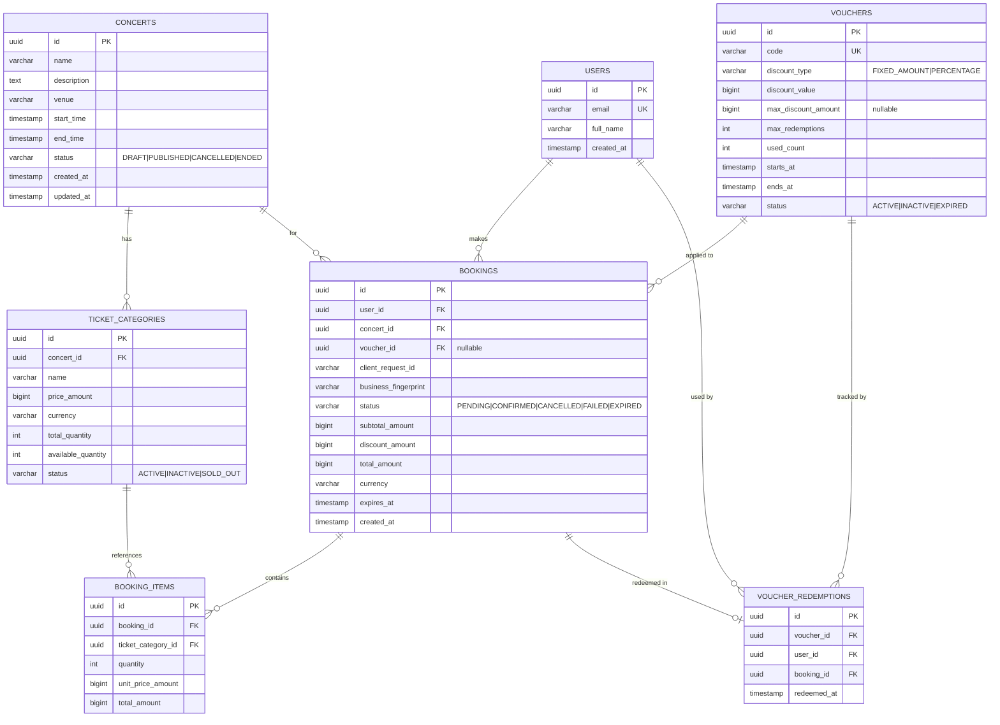
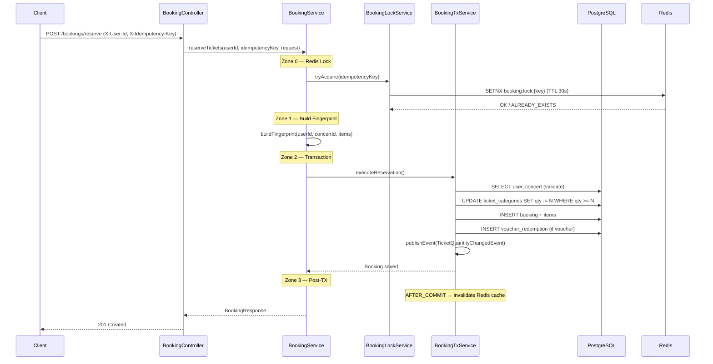

# 🎫 Concert Ticket Booking Platform

> **Technical Assessment — GI Summer 2026**  
> High-concurrency concert ticket booking system designed for flash-sale scenarios (~50,000 users, 300-500 booking requests/minute).

---

## 📋 Table of Contents

- [Tech Stack](#tech-stack)
- [Architecture Overview](#architecture-overview)
- [Database Design](#database-design)
- [API Documentation](#api-documentation)
- [Setup & Run Locally](#setup--run-locally)
- [Concurrency & Performance](#concurrency--performance)
- [Caching Strategy](#caching-strategy)
- [Booking Flow](#booking-flow)
- [Assumptions & Trade-offs](#assumptions--trade-offs)
- [What's Done / Not Done](#whats-done--not-done)
- [Coding Conventions](#coding-conventions)

---

## Tech Stack

| Layer | Technology | Version |
|-------|-----------|---------|
| Language | Java | 21 (Virtual Threads) |
| Framework | Spring Boot | 3.4.6 |
| Database | PostgreSQL | 17-alpine |
| Cache | Redis | 8-alpine |
| Distributed Lock | Redisson | 3.37.0 |
| ORM | Hibernate (JPA) | 6.6.15 |
| Migration | Flyway | 10.20 |
| Mapping | MapStruct | 1.6.3 |
| API Docs | Springdoc OpenAPI | 2.8.4 |
| Connection Pool | HikariCP | 5.1.0 |
| Build | Maven | 3.9+ |

---

## Architecture Overview

### Package Structure

```
src/main/java/vn/geekup/booking/
├── common/                           # Shared components
│   ├── dto/          PageResponse    # Pagination wrapper
│   ├── entity/       BaseAuditEntity # JPA auditing
│   └── exception/    GlobalExceptionHandler
│
├── config/                           # Infrastructure configs
│   ├── AuthInterceptor               # X-User-Id / X-Role auth
│   ├── RedisConfig                   # StringRedisTemplate + Lettuce pool
│   ├── RedissonConfig                # Distributed lock client
│   └── CacheProperties               # TTL config binding
│
├── domain/
│   ├── booking/                      # 🎫 Core booking domain
│   │   ├── controller/               # BookingController, AdminBookingController, WebhookController
│   │   ├── dto/                      # Request/Response records
│   │   ├── entity/                   # Booking, BookingItem, BookingStatus
│   │   ├── event/                    # TicketQuantityChangedEvent + Listener
│   │   ├── mapper/                   # MapStruct BookingMapper
│   │   ├── repository/               # JPA repositories
│   │   ├── scheduler/                # BookingExpiryScheduler (batch)
│   │   └── service/                  # BookingService, BookingTxService, BookingLockService
│   │
│   ├── concert/                      # 🎵 Concert domain
│   │   ├── controller/service/mapper/dto/entity/repository/
│   │   └── service/ConcertCacheService  # Redisson DCL cache
│   │
│   ├── ticket/                       # 🎟️ Ticket category domain
│   │   ├── controller/               # GET /api/v1/tickets/{id}
│   │   └── service/TicketCategoryCacheService  # Static + Dynamic split cache
│   │
│   ├── user/                         # 👤 User domain (entity + repo only)
│   └── voucher/                      # 🏷️ Voucher domain (entity + repo only)
```

### Layer Architecture

```
┌──────────────────────────────────────────────────────────────────┐
│  Client (Browser / Apidog)                                       │
├──────────────────────────────────────────────────────────────────┤
│  AuthInterceptor  ──  X-User-Id / X-Role validation             │
├──────────────────────────────────────────────────────────────────┤
│  Controller Layer  ──  @RestController, @Valid, @Operation       │
├──────────────────────────────────────────────────────────────────┤
│  Service Layer     ──  Business logic, @Transactional(readOnly)  │
│  ├── BookingService     ── Orchestration (Redis lock → TX → log) │
│  ├── BookingTxService   ── Transactional operations (write)      │
│  ├── ConcertCacheService   ── Redis cache + Redisson DCL         │
│  └── TicketCategoryCacheService ── Static/Dynamic split cache    │
├──────────────────────────────────────────────────────────────────┤
│  Repository Layer  ──  Spring Data JPA, @Query, @Lock            │
├──────────────────────────────────────────────────────────────────┤
│  PostgreSQL 17     │     Redis 8 (Lettuce + Redisson)            │
└──────────────────────────────────────────────────────────────────┘
```

---

## Database Design

### ER Diagram



### Index Strategy

| Index | Type | Purpose |
|-------|------|---------|
| `idx_uq_booking_fingerprint_pending` | Partial UNIQUE | Chỉ unique trên `business_fingerprint` khi `status = 'PENDING'` → chặn duplicate booking mà không block confirmed/expired records |
| `idx_bookings_worker_expiry` | Filtered | Scheduler scan nhanh: `WHERE status = 'PENDING'` chỉ index PENDING bookings |
| `uq_booking_user_client_request` | UNIQUE | Composite key `(user_id, client_request_id)` → DB-level idempotency guard |
| `uq_voucher_user` | UNIQUE | `(voucher_id, user_id)` → mỗi user chỉ dùng voucher 1 lần |
| `uq_booking_item_category` | UNIQUE | `(booking_id, ticket_category_id)` → 1 loại vé / booking |

### CHECK Constraints

- `total_amount = subtotal_amount - discount_amount` — DB đảm bảo tính toán đúng
- `available_quantity BETWEEN 0 AND total_quantity` — không bao giờ âm hoặc vượt tổng
- `discount_type = 'PERCENTAGE' → discount_value <= 100` — phần trăm max 100%

---

## API Documentation

### Swagger UI

Truy cập: **http://localhost:8080/swagger-ui.html**

### Endpoints

#### 🟢 Customer APIs

| Method | Path | Description | Auth |
|--------|------|-------------|------|
| `GET` | `/api/v1/concerts` | Danh sách concerts (paginated) | None |
| `GET` | `/api/v1/concerts/{id}` | Chi tiết concert + ticket categories | None |
| `GET` | `/api/v1/tickets/{id}` | Chi tiết loại vé (cached) | None |
| `POST` | `/api/v1/bookings/reserve` | Đặt vé (tạo PENDING booking) | `X-User-Id` + `X-Idempotency-Key` |
| `GET` | `/api/v1/bookings/{id}` | Chi tiết booking (chỉ chủ sở hữu) | `X-User-Id` |

#### 🔴 Admin APIs

| Method | Path | Description | Auth |
|--------|------|-------------|------|
| `GET` | `/api/v1/admin/bookings` | Danh sách bookings (filter by concert, status) | `X-Role: ADMIN` |
| `PATCH` | `/api/v1/admin/bookings/{id}/status` | Hủy booking | `X-Role: ADMIN` |

#### 🔵 Webhook APIs

| Method | Path | Description | Auth |
|--------|------|-------------|------|
| `POST` | `/api/v1/webhooks/payments` | Payment gateway callback | None (internal) |

### Auth Model

```
Customer endpoints → Header: X-User-Id: {uuid}
Admin endpoints    → Header: X-Role: ADMIN
Webhook endpoints  → No auth (internal network)
Public endpoints   → No auth (concerts, tickets)
```

### Error Response Format

```json
{
  "timestamp": "2026-05-21T12:00:00",
  "status": 400,
  "error": "Bad Request",
  "message": "Vé VIP đã bán hết hoặc không đủ số lượng.",
  "path": "/api/v1/bookings/reserve"
}
```

---

## Setup & Run Locally

### Prerequisites

- **Java 21+** (với Virtual Threads support)
- **Docker Desktop** (cho PostgreSQL + Redis)
- **Maven 3.9+**

### Quick Start

```bash
# 1. Clone repository
git clone <repo-url>
cd booking_ticket

# 2. Start infrastructure (PostgreSQL + Redis)
docker-compose up -d

# 3. Wait for health checks
docker-compose ps  # Verify both services are "healthy"

# 4. Run application
mvn spring-boot:run

# 5. Access Swagger UI
# Open: http://localhost:8080/swagger-ui.html
```

### Environment Variables

| Variable | Default | Description |
|----------|---------|-------------|
| `DB_URL` | `jdbc:postgresql://localhost:5433/booking_ticket` | PostgreSQL JDBC URL |
| `DB_USERNAME` | `postgres` | Database username |
| `DB_PASSWORD` | `postgres` | Database password |
| `REDIS_HOST` | `localhost` | Redis host |
| `REDIS_PORT` | `6379` | Redis port |
| `REDIS_PASSWORD` | *(set in compose)* | Redis password |

### Seed Test Data

```sql
-- Connect to DB
docker exec -it booking_ticket_postgres psql -U postgres -d booking_ticket

-- Insert test users
INSERT INTO users (id, email, full_name) VALUES
('11111111-1111-1111-1111-111111111111', 'user1@test.com', 'Test User 1'),
('22222222-2222-2222-2222-222222222222', 'user2@test.com', 'Test User 2');

-- Insert concert
INSERT INTO concerts (id, name, description, venue, start_time, end_time, status) VALUES
('aaaaaaaa-aaaa-aaaa-aaaa-aaaaaaaaaaaa', 'Rock Festival 2026', 
 'Epic rock concert featuring top artists', 'Stadium A', 
 '2026-07-01 19:00:00', '2026-07-01 23:00:00', 'PUBLISHED');

-- Insert ticket categories
INSERT INTO ticket_categories (id, concert_id, name, price_amount, currency, total_quantity, available_quantity, status) VALUES
('bbbbbbbb-bbbb-bbbb-bbbb-bbbbbbbbbb01', 'aaaaaaaa-aaaa-aaaa-aaaa-aaaaaaaaaaaa', 'VIP', 2000000, 'VND', 100, 100, 'ACTIVE'),
('bbbbbbbb-bbbb-bbbb-bbbb-bbbbbbbbbb02', 'aaaaaaaa-aaaa-aaaa-aaaa-aaaaaaaaaaaa', 'Standard', 500000, 'VND', 500, 500, 'ACTIVE'),
('bbbbbbbb-bbbb-bbbb-bbbb-bbbbbbbbbb03', 'aaaaaaaa-aaaa-aaaa-aaaa-aaaaaaaaaaaa', 'Economy', 200000, 'VND', 1000, 1000, 'ACTIVE');

-- Insert voucher
INSERT INTO vouchers (id, code, discount_type, discount_value, max_discount_amount, max_redemptions, used_count, starts_at, ends_at, status) VALUES
('cccccccc-cccc-cccc-cccc-cccccccccccc', 'SUMMER2026', 'PERCENTAGE', 10, 100000, 100, 0, '2026-01-01 00:00:00', '2026-12-31 23:59:59', 'ACTIVE');
```

---

## Concurrency & Performance

### 1. Overselling Prevention

```java
// Atomic SQL — decrements only if sufficient quantity
@Query("UPDATE TicketCategory tc SET tc.availableQuantity = tc.availableQuantity - :qty " +
       "WHERE tc.id = :id AND tc.availableQuantity >= :qty")
int decrementAvailableQuantity(@Param("id") UUID id, @Param("qty") int qty);
```

**Mechanism**: PostgreSQL row-level lock during UPDATE → concurrent requests serialize on the same row → `available_quantity` never goes negative.

### 2. Duplicate Booking Prevention (3 Layers)

```
Layer 1: Redis SETNX     → X-Idempotency-Key (TTL 30s)   → Chặn retry nhanh
Layer 2: DB UNIQUE        → (user_id, client_request_id)  → Chặn vĩnh viễn 
Layer 3: Partial Index    → business_fingerprint PENDING   → Chặn cùng user+concert+items
```

### 3. Connection Pooling

| Pool | Config | Purpose |
|------|--------|---------|
| HikariCP | max=20, min-idle=5, timeout=5s, leak-detect=30s | PostgreSQL connections |
| Lettuce | max-active=16, max-idle=8, min-idle=4, timeout=2s | Redis connections |
| Redisson | pool=16, min-idle=4 | Distributed lock connections |

### 4. Virtual Threads (Java 21)

```yaml
spring.threads.virtual.enabled: true
```

Mỗi HTTP request chạy trên Virtual Thread → hàng nghìn concurrent requests không cần thread pool lớn.

### 5. Batch Expiry Processing

```
Scheduler (mỗi phút) → SELECT expired IDs
  → Chunk 20 bookings/transaction
  → 1 SELECT FETCH JOIN + aggregate ticket qty → batch UPDATE
  → 850 queries (old) → ~15 queries (new)
```

---

## Caching Strategy

### Concert Detail — Redisson Double-Check Locking

```
GET /api/v1/concerts/{id}

┌─ Check Redis ──────────────────────┐
│ KEY: concert:{id}                  │
│ HIT → return cached JSON           │
│ MISS ↓                             │
├─ Acquire Redisson RLock ───────────┤
│ lock("cache:concert:{id}")         │
│ ├─ Double-check Redis (recheck)    │
│ │   HIT → return (another thread   │
│ │         already loaded)           │
│ │   MISS ↓                         │
│ ├─ Query PostgreSQL                │
│ ├─ SET Redis (TTL 600s)            │
│ └─ Release lock                    │
└────────────────────────────────────┘
```

### Ticket Category — Static/Dynamic Split Cache

```
GET /api/v1/tickets/{id}

Static cache:  ticket:static:{id}  → {name, price, currency, totalQty, status}  TTL 600s
Dynamic cache: ticket:qty:{id}     → availableQuantity                          TTL 600s

┌─ Redis MGET (1 round-trip) ────────┐
│ MGET ticket:static:{id}            │
│      ticket:qty:{id}               │
│                                     │
│ Both HIT → merge & return           │
│ Any MISS → Redisson DCL → query DB  │
│         → SET both keys             │
└─────────────────────────────────────┘
```

### Cache Invalidation — Event-Driven AFTER_COMMIT

```
BookingTxService (inside @Transactional)
  → publishEvent(TicketQuantityChangedEvent)
  → @TransactionalEventListener(AFTER_COMMIT)
  → TicketCacheInvalidationListener
  → try { redisTemplate.delete(key) } catch { log.error() }
       ↑ NEVER throws — Redis fail ≠ user 500
```

---

## Booking Flow

### Reserve Tickets Sequence



### Payment Webhook Flow

```
POST /webhooks/payments {bookingId, status: "SUCCESS"|"FAILED"}
  → BookingTxService.processPayment()
  → SELECT FOR UPDATE (pessimistic lock)
  → IF not PENDING → return (idempotent)
  → IF SUCCESS → status = CONFIRMED
  → IF FAILED  → status = FAILED + releaseTickets()
  → AFTER_COMMIT → invalidate ticket cache
```

### Booking Expiry Flow

```
@Scheduled(every minute)
  → SELECT IDs WHERE status=PENDING AND expires_at < NOW
  → Chunk (20/batch)
  → FOR EACH chunk:
      → SELECT FETCH JOIN items+ticketCategory WHERE id IN (:ids) AND status=PENDING FOR UPDATE
      → Aggregate: Map<ticketCategoryId, totalQtyToRestore>
      → UPDATE ticket_categories SET qty += aggregate
      → UPDATE bookings SET status = EXPIRED
      → AFTER_COMMIT → invalidate cache
```

---

## Assumptions & Trade-offs

### Assumptions

1. **Auth đơn giản**: Hệ thống dùng header-based auth (`X-User-Id`, `X-Role`) thay vì JWT/OAuth2. Giả định API Gateway sẽ xử lý xác thực thực sự và inject headers.

2. **Voucher không hoàn lại**: Khi booking bị hủy/hết hạn/thất bại, voucher **KHÔNG** được hoàn lại. Business rule: mỗi user chỉ dùng voucher 1 lần — nếu không thanh toán → mất lượt.

3. **Tiền tệ VND**: Hệ thống chỉ hỗ trợ VND, dùng kiểu `Long` (không thập phân).

4. **Single instance**: Scheduler dùng `@Scheduled` — chạy trên 1 instance. Nếu deploy multi-instance cần thêm ShedLock.

### Trade-offs

| Decision | Lý do | Hạn chế |
|----------|-------|---------|
| Atomic SQL UPDATE thay vì distributed lock cho vé | Đơn giản, PostgreSQL đảm bảo ACID | Throughput phụ thuộc DB row-level locking |
| Redisson DCL cho cache miss | Chống cache stampede | Thêm dependency Redisson |
| Split static/dynamic cache | Giảm Redis write khi booking → chỉ invalidate qty | 2 Redis calls per ticket detail |
| Event-driven cache invalidation | Đảm bảo cache chỉ xóa SAU khi DB commit | Nếu Redis sập → stale cache (tự heal qua TTL) |
| `open-in-view: false` | Best practice — không giữ session/connection trong view | Phải dùng FETCH JOIN rõ ràng |

---

## What's Done / Not Done

### ✅ Done

- [x] Full booking flow: Reserve → Payment → Confirm/Fail
- [x] Automatic booking expiry (batch, chunked)
- [x] Overselling prevention (atomic SQL)
- [x] Duplicate booking prevention (3 layers)
- [x] Voucher system (PERCENTAGE + FIXED_AMOUNT, max cap, per-user limit)
- [x] Redis caching (concert detail DCL, ticket static/dynamic split)
- [x] Cache invalidation (event-driven AFTER_COMMIT)
- [x] Connection pooling (HikariCP + Lettuce + Redisson)
- [x] API documentation (Swagger/OpenAPI)
- [x] Flyway migration
- [x] GlobalExceptionHandler
- [x] Input validation (Bean Validation)
- [x] Admin booking management
- [x] Virtual Threads (Java 21)

### ❌ Not Done (Out of Scope)

- [ ] Admin CRUD cho concerts/tickets (seeded trực tiếp DB)
- [ ] Rate limiting (recommend Bucket4j hoặc Resilience4j)
- [ ] Distributed scheduler (recommend ShedLock)
- [ ] Webhook signature verification (recommend HMAC)
- [ ] User registration/login (simplified header-based auth)
- [ ] Load testing / performance benchmarks

---

## Coding Conventions

### General

- **Package structure**: Domain-based (`domain/{booking, concert, ticket, ...}`)
- **DTOs**: Java `record` — immutable, auto `equals/hashCode/toString`
- **Entities**: `@Getter/@Setter` (Lombok) — KHÔNG dùng `@Data` trên JPA entity
- **Injection**: Constructor injection via `@RequiredArgsConstructor`
- **Validation**: `@Valid` trên tất cả request DTOs, Bean Validation annotations
- **Mapping**: MapStruct (compile-time code generation, không reflection)

### Transaction Rules

- `@Transactional` chỉ ở Service layer, KHÔNG ở Controller
- `@Transactional(readOnly = true)` cho read-only queries
- `Propagation.MANDATORY` cho methods phải chạy trong existing TX
- **KHÔNG gọi Redis/HTTP bên trong `@Transactional`** — defer qua event

### Commit Convention

```
<type>(<scope>): <description>

Types: feat, fix, refactor, perf, test, ci, docs, chore, security
```

---

## License

This project is a technical assessment submission. All rights reserved.
