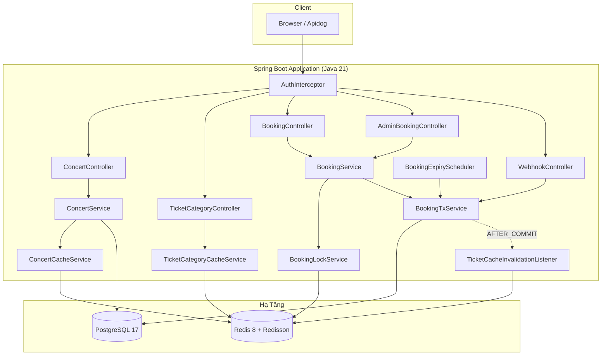
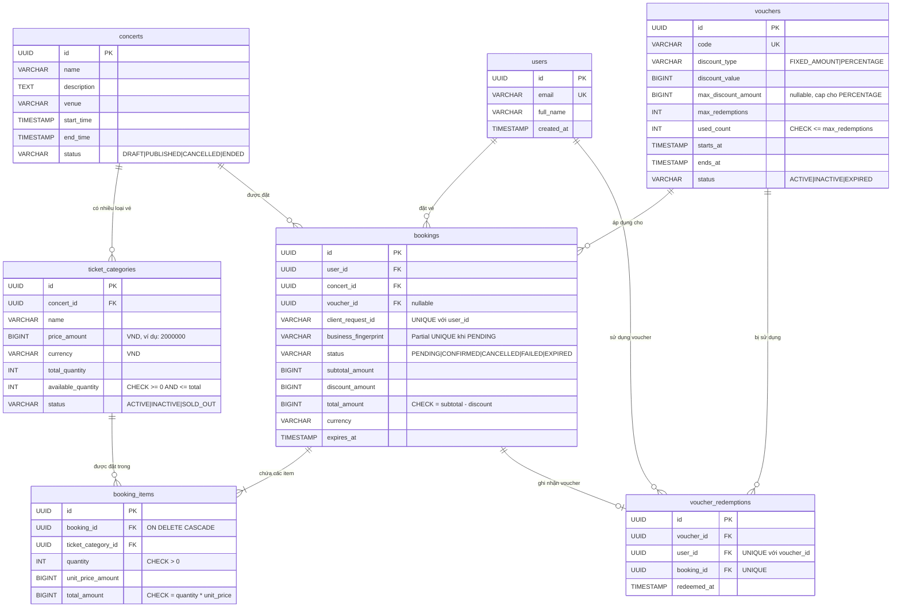
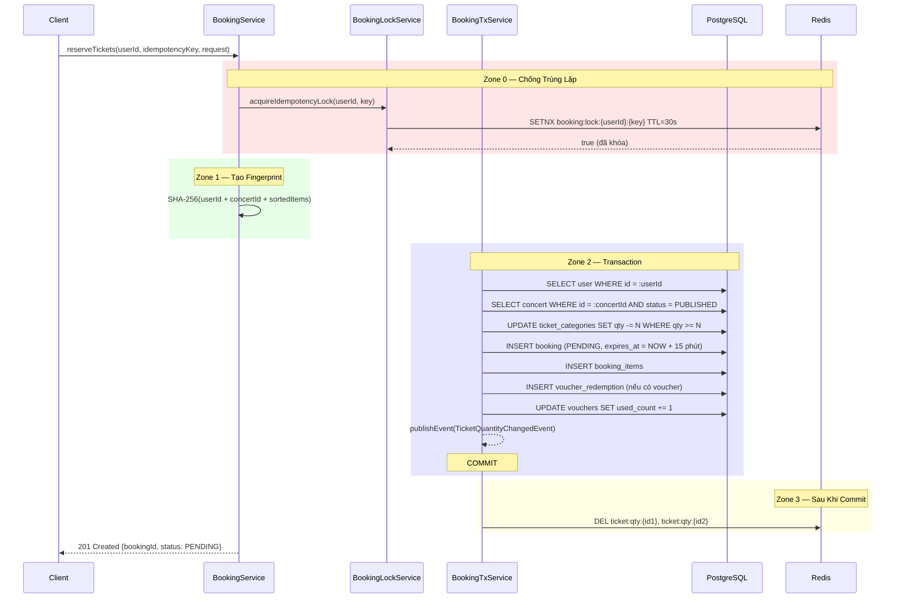
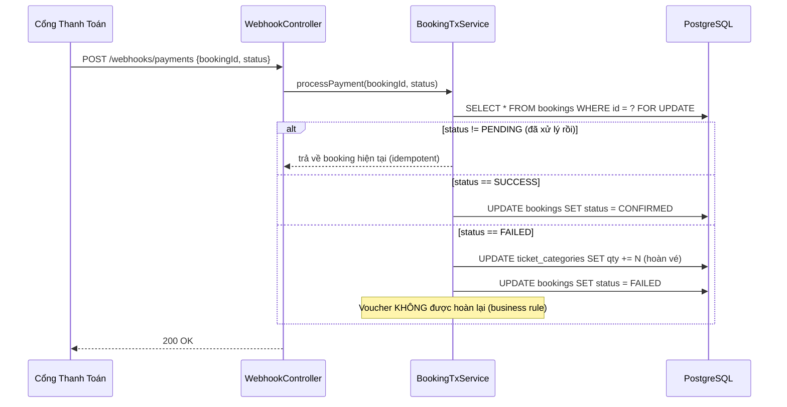
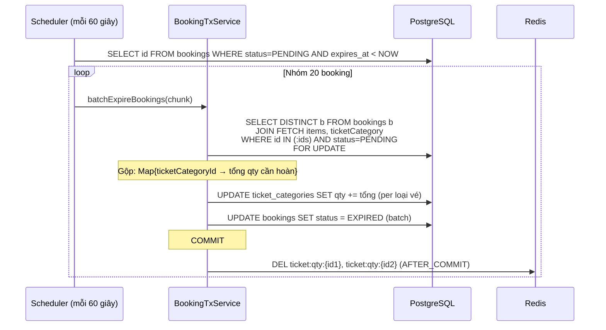

# Tài Liệu Thiết Kế Hệ Thống — Nền Tảng Đặt Vé Concert

> Phiên bản 1.2 | Tháng 5/2026

---

## Mục Lục

1. [Kiến Trúc Tổng Quan](#1-kiến-trúc-tổng-quan)
2. [Thiết Kế Cơ Sở Dữ Liệu](#2-thiết-kế-cơ-sở-dữ-liệu)
3. [Luồng Đặt Vé — Sequence Diagrams](#3-luồng-đặt-vé--sequence-diagrams)
4. [Chiến Lược Cache](#4-chiến-lược-cache)
5. [Kiểm Soát Đồng Thời (Concurrency)](#5-kiểm-soát-đồng-thời-concurrency)
6. [Xác Thực & Phân Quyền](#6-xác-thực--phân-quyền)
7. [Xử Lý Lỗi](#7-xử-lý-lỗi)
8. [Cấu Hình & Hạ Tầng](#8-cấu-hình--hạ-tầng)
9. [Hiệu Năng](#9-hiệu-năng)

---

## 1. Kiến Trúc Tổng Quan



### 1.1 Tại Sao Chọn Kiến Trúc Này?

Hệ thống sử dụng kiến trúc **Layered Monolith với Domain Separation** thay vì microservices. Lý do:

| Quyết định | Phân tích |
|------------|-----------|
| **Monolith** | Một nền tảng đặt vé concert không cần sự phức tạp vận hành (deploy, network, tracing) của microservices. Một JVM duy nhất với Virtual Threads xử lý được ~1000 booking đồng thời. |
| **Domain packages** | Các domain (`booking`, `concert`, `ticket`, `voucher`, `user`) được tổ chức riêng biệt. Mỗi domain sở hữu entity, repository, service, DTO, mapper riêng. Nếu sau này cần scale, việc tách domain thành service riêng rất dễ dàng vì dependencies đã sạch. |
| **Tách BookingService / BookingTxService** | `BookingService` xử lý orchestration (Redis lock, fingerprint) — KHÔNG có `@Transactional`. `BookingTxService` xử lý logic nghiệp vụ thuần túy trong transaction. Việc tách này đảm bảo **không bao giờ gọi Redis/HTTP bên trong `@Transactional`**, tránh giữ DB connection suốt thời gian network I/O. |

### 1.2 Tại Sao Dùng Hai Redis Client (Lettuce + Redisson)?

| Client | Vai trò | Lý do |
|--------|---------|-------|
| **Lettuce** (qua `spring-data-redis`) | Cache read/write, SETNX idempotency | Nhẹ, async-capable, Spring Boot tự động cấu hình. Phù hợp cho thao tác đơn giản (GET/SET/DEL/MGET/SETNX). |
| **Redisson** | Distributed lock (DCL pattern) | Cung cấp `RLock` với watchdog tự động gia hạn TTL khi thread vẫn đang giữ lock. Lettuce không có cơ chế tương đương. Thay thế bằng Lua script tự viết thì dễ lỗi và khó maintain. |

---

## 2. Thiết Kế Cơ Sở Dữ Liệu

### 2.1 Entity-Relationship Diagram



### 2.2 Phân Tích Quyết Định Thiết Kế

| Quyết định | Lý do | Phương án đã loại bỏ |
|------------|-------|----------------------|
| **UUID làm primary key** | Ngăn chặn ID enumeration attack. Client có thể generate ID trước request (hữu ích cho idempotency). | Auto-increment — đơn giản hơn nhưng lộ business volume và có thể bị brute-force |
| **Tiền tệ dạng BIGINT** | VND không có phần thập phân → `Long` loại bỏ hoàn toàn lỗi floating-point. 500.000 VNĐ = `500000` | `BigDecimal` — overhead không cần thiết cho đơn vị tiền không có phần lẻ |
| **CHECK constraints trên quantity** | DB là tuyến phòng thủ cuối. Dù logic ứng dụng có bug, `available_quantity >= 0` vẫn ngăn overselling ở tầng database. | Chỉ validate ở application — single point of failure |
| **Partial unique index trên fingerprint** | `business_fingerprint` chỉ UNIQUE khi `status = 'PENDING'`. User có thể đặt lại cùng concert + vé sau khi booking trước đã expire/cancel. | Full unique index — chặn vĩnh viễn việc đặt lại cùng combination |
| **Filtered index cho scheduler** | `idx_bookings_worker_expiry` chỉ index `PENDING` bookings. Scheduler chỉ query `WHERE status = 'PENDING' AND expires_at < NOW()`. Index không bị phình bởi các row confirmed/expired. | Full index — lãng phí storage và I/O cho các row scheduler không bao giờ đọc |
| **ON DELETE CASCADE cho booking_items** | Booking item vô nghĩa nếu không có parent booking. Cascade đơn giản hóa cleanup và ngăn orphan rows. | Xóa thủ công — nhiều code hơn, cùng kết quả, rủi ro orphan |
| **Bảng voucher_redemptions riêng** | Enforce `UNIQUE(voucher_id, user_id)` ở tầng DB — mỗi user chỉ dùng voucher 1 lần, bất kể booking status. Đồng thời là audit trail. | Lưu voucher usage trong booking entity — mất khả năng unique constraint |
| **CHECK: total_amount = subtotal - discount** | DB tự validate tính toàn vẹn số tiền. Nếu application tính sai, INSERT/UPDATE sẽ bị reject. | Chỉ validate ở application — nếu bug thì data sai âm thầm |
| **CHECK: quantity * unit_price = total_amount** | Tương tự — đảm bảo booking_items luôn consistent, không phụ thuộc application logic. | Chỉ validate ở application |

### 2.3 Chuẩn Hoá (3NF)

- `ticket_categories` ↔ `concerts`: Một concert có N loại vé (VIP, Standard, v.v.). Denormalize ticket info vào bookings sẽ gây update anomalies.
- `booking_items` ↔ `bookings`: Một booking chứa nhiều loại vé. Đây là pattern order/order-items chuẩn.
- `voucher_redemptions` ↔ `bookings`: Tách riêng để enforce quy tắc "1 user / 1 voucher" độc lập với lifecycle của booking.

### 2.4 Cột An Toàn Cho Đồng Thời

```sql
-- Atomic decrement: qty không bao giờ xuống dưới 0
UPDATE ticket_categories SET available_quantity = available_quantity - :qty
WHERE id = :id AND available_quantity >= :qty;
-- Trả về 0 rows affected nếu không đủ vé → application throw BusinessException

-- Atomic increment: used_count không bao giờ vượt max_redemptions
UPDATE vouchers SET used_count = used_count + 1
WHERE id = :id AND used_count < max_redemptions;
-- Trả về 0 rows affected nếu đã hết lượt → application throw BusinessException
```

**Tại sao dùng atomic SQL thay vì SELECT rồi UPDATE?**

Cách tiếp cận naive (`SELECT qty → kiểm tra trong Java → UPDATE`) có lỗi **TOCTOU race condition** (Time-Of-Check to Time-Of-Use). Giữa thời điểm SELECT và UPDATE, thread khác có thể đã decrement cùng row đó. Mệnh đề WHERE atomic loại bỏ hoàn toàn vấn đề này — PostgreSQL đảm bảo atomicity ở mức row.

### 2.5 Chiến Lược Indexing

| Index | Loại | Mục đích |
|-------|------|----------|
| `idx_uq_booking_fingerprint_pending` | Partial UNIQUE | Chặn booking trùng nội dung khi đang PENDING |
| `idx_bookings_worker_expiry` | Partial (WHERE PENDING) | Scheduler tìm booking hết hạn nhanh, không quét confirmed/expired |
| `idx_concerts_status` | B-tree | API list concerts lọc theo status |
| `idx_ticket_categories_concert_id` | B-tree | JOIN concert ↔ ticket_categories |
| `idx_bookings_user_id` | B-tree | API "xem booking của tôi" |
| `idx_bookings_concert_id` | B-tree | Admin lọc booking theo concert |
| `idx_vouchers_code` | B-tree | Tìm voucher theo code |

---

## 3. Luồng Đặt Vé — Sequence Diagrams

### 3.1 Đặt Vé (Happy Path)



### 3.2 Tại Sao Chia Thành 3 Zone?

Luồng đặt vé được tách thành các zone riêng biệt để thực thi quy tắc quan trọng: **tuyệt đối không trộn lẫn external I/O với database transaction**.

| Zone | Mục đích | Tại sao phải tách? |
|------|----------|-------------------|
| **Zone 0** | Redis SETNX | Chạy TRƯỚC transaction. Nếu Redis chết, fail nhanh mà không mở DB connection. |
| **Zone 1** | SHA-256 fingerprint | Tính toán CPU thuần túy. Không I/O. |
| **Zone 2** | Database transaction | Tất cả DB writes trong một transaction duy nhất. Không có Redis/HTTP call bên trong. Transaction giữ DB connection trong thời gian tối thiểu. |
| **Zone 3** | Cache invalidation | Chạy SAU COMMIT qua Spring Event. Nếu Redis fail ở đây, DB đã commit thành công (business success). Catch block nuốt exception — cache tự phục hồi khi TTL hết hạn. |

**Nếu Redis chết giữa Zone 0 và Zone 2 thì sao?**

Zone 0 đã acquire lock nhưng Zone 2 throw exception → block `catch` trong `BookingService.reserveTickets()` gọi `releaseIdempotencyLock()`. Nếu release cũng fail (Redis chết), lock tự hết hạn sau 30s TTL. User có thể retry sau 30 giây.

### 3.3 Payment Webhook



**Tại sao dùng `SELECT FOR UPDATE`?**

Payment webhook và scheduler expiry có thể chạy race trên cùng một booking. Nếu không có `FOR UPDATE`, cả hai đọc `status = PENDING` đồng thời, dẫn đến:
- Hoàn vé 2 lần (qty tăng gấp đôi)
- Conflict status update

`FOR UPDATE` serialize quyền truy cập — transaction thứ 2 block cho đến khi transaction thứ 1 commit, sau đó đọc lại status (giờ đã không còn PENDING) và bỏ qua xử lý.

**Tại sao voucher KHÔNG được hoàn lại khi thanh toán thất bại?**

Quy tắc nghiệp vụ: mỗi user chỉ được sử dụng voucher 1 lần. Nếu hoàn lại voucher, user xấu có thể:
1. Đặt vé với voucher → được giảm giá
2. Cố tình thanh toán thất bại → voucher được hoàn
3. Đặt lại với cùng voucher → vòng lặp giảm giá vô hạn

Record `voucher_redemptions` với `UNIQUE(voucher_id, user_id)` chặn vĩnh viễn việc tái sử dụng.

### 3.4 Hết Hạn Hàng Loạt (Batch Expiry)



**Tại sao xử lý batch thay vì từng booking một?**

| Cách tiếp cận | SQL statements (100 booking, 3 loại vé) | Phân tích |
|----------------|------------------------------------------|-----------|
| **Từng booking** | `100 × SELECT + 100 × UPDATE items + 100 × UPDATE booking = 300+` | Nhiều round-trip DB, mỗi booking = 1 transaction, overhead lớn |
| **Batch (chunk=20)** | `5 chunk × (1 SELECT JOIN + 3 UPDATE category + 1 batch UPDATE) = 25` | Ít round-trip hơn 12 lần. Gộp ticket qty bằng Java → 1 UPDATE / loại vé |

**Tại sao chunk size = 20?**
- Quá nhỏ (1-5): overhead transaction setup chiếm ưu thế
- Quá lớn (100+): transaction giữ `FOR UPDATE` lock trên nhiều row quá lâu, chặn payment webhook cho các booking đó
- 20 là điểm cân bằng: ~5-10ms / chunk, lock được giải phóng nhanh

---

## 4. Chiến Lược Cache

### 4.1 Các Tầng Cache

```
┌────────────────────────────────────────────────────────────┐
│                    Kiến Trúc Cache                          │
├────────────────────────────────────────────────────────────┤
│                                                            │
│  Cache Chi Tiết Concert                                    │
│  ├── KEY:  concert:detail:{concertId}                      │
│  ├── VALUE: JSON (ConcertDetailResponse)                   │
│  ├── TTL:  600 giây (10 phút)                              │
│  └── Chiến lược: Redisson DCL (Double-Check Locking)       │
│                                                            │
│  Cache Loại Vé — Phần Tĩnh                                 │
│  ├── KEY:  ticket:static:{ticketCategoryId}                │
│  ├── VALUE: JSON {name, price, currency, totalQty, status} │
│  ├── TTL:  600 giây                                        │
│  └── Chiến lược: Redisson DCL khi MISS                     │
│                                                            │
│  Cache Loại Vé — Phần Động                                 │
│  ├── KEY:  ticket:qty:{ticketCategoryId}                   │
│  ├── VALUE: availableQuantity (số nguyên dạng string)      │
│  ├── TTL:  600 giây                                        │
│  ├── Invalidation: @TransactionalEventListener             │
│  └── Chiến lược: DEL khi số lượng vé thay đổi             │
│                                                            │
│  Khóa Chống Trùng Booking                                  │
│  ├── KEY:  booking:lock:{userId}:{idempotencyKey}          │
│  ├── VALUE: "PROCESSING"                                   │
│  ├── TTL:  30 giây                                         │
│  └── Chiến lược: SETNX (Set if Not Exists)                 │
│                                                            │
└────────────────────────────────────────────────────────────┘
```

### 4.2 Tại Sao Tách Cache Tĩnh / Động Cho Loại Vé?

Dữ liệu loại vé có hai thành phần với tần suất thay đổi khác nhau hoàn toàn:

| Thành phần | Tần suất thay đổi | Ví dụ |
|------------|-------------------|-------|
| **Tĩnh** (name, price, currency, totalQty, status) | Chỉ khi admin cập nhật sự kiện. Có thể cache hàng giờ. | Tên "VIP", giá 2.000.000 VNĐ |
| **Động** (availableQuantity) | Thay đổi mỗi khi có booking/cancel/expire. Phải invalidate ngay. | 98 → 96 → 97 |

Nếu cache cả object thành 1 key duy nhất, mỗi booking sẽ invalidate toàn bộ cache bao gồm cả dữ liệu tĩnh, gây DB read không cần thiết ở request tiếp theo. Bằng cách tách:
- Booking chỉ invalidate `ticket:qty:{id}` (1 lệnh DEL)
- Cache tĩnh tồn tại xuyên suốt các booking (không có DB hit thừa)
- Khi đọc: `MGET` lấy cả 2 key trong 1 round-trip, merge trong application

### 4.3 Tại Sao Dùng Double-Check Locking (DCL) Khi Cache Miss?

Không có DCL, hiện tượng **cache stampede** xảy ra khi cache của concert hot bị hết hạn:

```
Không DCL (100 thread đồng thời):
  1. 100 thread đọc null từ cache
  2. 100 thread đều query DB       ← 100 query giống hệt nhau!
  3. 100 thread đều write cache    ← 99 lần write thừa

Có DCL (100 thread đồng thời):
  1. 100 thread đọc null từ cache
  2. Thread 1 acquire Redisson lock, 99 thread block (chờ)
  3. Thread 1 query DB, write cache, release lock
  4. 99 thread thức dậy, re-check cache (HIT), trả về không query DB
  → Chỉ 1 DB query thay vì 100
```

Lock chỉ giữ ~5-10ms (1 lần DB read + 1 lần Redis write). Chi phí rất thấp.

### 4.4 Invalidation — Tại Sao AFTER_COMMIT?

```
BookingTxService sửa ticket_categories
  → publishEvent(TicketQuantityChangedEvent)
  → @TransactionalEventListener(phase = AFTER_COMMIT)
  → TicketCacheInvalidationListener
  → DEL ticket:qty:{id} (trong try-catch, KHÔNG BAO GIỜ throw)
```

| Thời điểm invalidate | Vấn đề |
|----------------------|--------|
| **Trong transaction** | Nếu transaction rollback sau đó (ví dụ constraint violation), cache đã bị xóa nhưng DB không thay đổi → cache cold vô ích |
| **Trước transaction** | Tương tự — xóa cache trước, transaction fail → cache cold vô cớ |
| **SAU COMMIT ✅** | DB đã commit (data consistent) → invalidate cache. Nếu Redis fail, cache cũ tự hết hạn khi TTL hết (tối đa 600s staleness) |

**Tại sao catch block KHÔNG throw exception?**

Kịch bản nguy hiểm: DB vừa commit xong, mạng đứt, Redis sập. Listener gọi `redisTemplate.delete()`, Redis throw `RedisConnectionFailureException`. Nếu exception dội lên Controller → user nhận HTTP 500, dù DB đã commit thành công (vé đã bị trừ, booking đã tạo). **Business đã thành công → user phải thấy 201, không phải 500.** Cache miss chấp nhận được (tự heal), nhưng 500 thì không.

---

## 5. Kiểm Soát Đồng Thời (Concurrency)

### 5.1 Ma Trận Mối Đe Dọa

| Mối đe dọa | Giải pháp | Tầng | Phân tích |
|-------------|-----------|------|-----------|
| **Bán vượt số lượng (Overselling)** | Atomic `UPDATE SET qty -= N WHERE qty >= N` | PostgreSQL | Một thao tác atomic duy nhất, không có TOCTOU race. CHECK constraint ở DB là safety net. |
| **Booking trùng lặp (retry nhanh)** | SETNX `booking:lock:{userId}:{key}` TTL 30s | Redis | Nhanh, in-memory. Chặn xử lý trùng trước khi chạm DB. |
| **Booking trùng lặp (replay)** | UNIQUE `(user_id, client_request_id)` | PostgreSQL | Constraint ở DB là lớp thứ 2. Dù Redis lock hết hạn, DB vẫn bắt trùng. |
| **Cùng nội dung booking** | Partial UNIQUE INDEX trên `business_fingerprint` WHERE PENDING | PostgreSQL | Chặn booking giống hệt nhau (cùng user, cùng vé) nhưng cho phép đặt lại sau khi expire. |
| **Cache stampede** | Redisson RLock DCL (blocking, watchdog 30s) | Redis/Redisson | Chỉ 1 thread query DB khi cache miss. Các thread khác chờ rồi đọc từ cache. |
| **Race: expire vs payment** | `SELECT FOR UPDATE` trên booking row | PostgreSQL | Serialize quyền truy cập. Thao tác thứ 2 thấy status đã cập nhật và bỏ qua. |
| **Voucher dùng 2 lần** | Atomic increment + UNIQUE(voucher_id, user_id) | PostgreSQL | Hai lớp: SQL atomic chống exhaustion đồng thời, unique index chống cùng user dùng lại. |

### 5.2 Phòng Thủ Theo Chiều Sâu (Defense in Depth)

Hệ thống sử dụng **3 lớp chống trùng** cho booking:

```
Lớp 1: Redis SETNX (nhanh, ~1ms)
  ↓ pass
Lớp 2: Business fingerprint (DB partial unique index)
  ↓ pass
Lớp 3: Client request ID (DB unique constraint)
  ↓ pass
→ Booking được tạo

Mỗi lớp bắt một loại failure khác nhau:
• Lớp 1: User click "Đặt vé" liên tục (trong cửa sổ 30s)
• Lớp 2: User đặt cùng concert + vé (dù dùng request ID khác)
• Lớp 3: Network retry gửi lại cùng request với cùng client ID
```

### 5.3 Chiến Lược Pessimistic Locking

```sql
-- Thao tác đơn lẻ (payment, cancel)
SELECT * FROM bookings WHERE id = ? FOR UPDATE;

-- Thao tác hàng loạt (scheduler expiry)
SELECT DISTINCT b FROM bookings b
  JOIN FETCH items, ticketCategory
  WHERE id IN (:ids) AND status = 'PENDING'
  FOR UPDATE OF b;
```

---

## 6. Xác Thực & Phân Quyền

### 6.1 Mô Hình Đơn Giản (Header-Based)

Hệ thống sử dụng xác thực đơn giản qua HTTP headers thay vì JWT/OAuth2 (theo yêu cầu đề bài assessment):

```
┌────────────────────────────────────────────┐
│              AuthInterceptor               │
├────────────────────────────────────────────┤
│                                            │
│  /api/v1/admin/**                          │
│  └── Yêu cầu: X-Role: ADMIN               │
│      Thiếu/sai → 403 Forbidden            │
│                                            │
│  /api/v1/webhooks/**                       │
│  └── Không yêu cầu xác thực               │
│      (gọi từ payment gateway nội bộ)       │
│                                            │
│  /api/v1/bookings/**                       │
│  └── Yêu cầu: X-User-Id: {uuid}           │
│      Thiếu → 401 Unauthorized             │
│      Format sai → 400 Bad Request          │
│                                            │
│  /api/v1/concerts/**                       │
│  └── Yêu cầu: X-User-Id: {uuid}           │
│      (intercepted nhưng concert public)    │
│                                            │
│  /api/v1/tickets/**                        │
│  └── Excluded khỏi interceptor             │
│      (endpoint public hoàn toàn)           │
│                                            │
└────────────────────────────────────────────┘
```

### 6.2 Phân Quyền Theo Endpoint

| Endpoint | Quyền | Headers |
|----------|-------|---------|
| `GET /api/v1/concerts` | Public (cần X-User-Id nhưng không validate user tồn tại) | `X-User-Id` |
| `GET /api/v1/concerts/{id}` | Public | `X-User-Id` |
| `GET /api/v1/tickets/{id}` | Hoàn toàn public | Không cần |
| `POST /api/v1/bookings/reserve` | Customer | `X-User-Id`, `X-Idempotency-Key` |
| `GET /api/v1/bookings/{id}` | Customer (chỉ xem booking của mình) | `X-User-Id` |
| `GET /api/v1/admin/bookings` | Admin only | `X-Role: ADMIN` |
| `PATCH /api/v1/admin/bookings/{id}/status` | Admin only | `X-Role: ADMIN` |
| `POST /api/v1/webhooks/payments` | Internal (no auth) | Không cần |

---

## 7. Xử Lý Lỗi

### 7.1 Ma Trận Exception → HTTP Response

| Exception | HTTP | Message | Phục hồi |
|-----------|------|---------|----------|
| `ResourceNotFoundException` | 404 | "Concert not found: {id}" | Client dùng ID đúng |
| `BusinessException` | 400 | "Vé VIP đã bán hết hoặc không đủ số lượng." | Client hiển thị thông báo cho user |
| `ForbiddenException` | 403 | "Admin access required" | Client thêm auth header đúng |
| `MethodArgumentNotValidException` | 400 | "concertId: is required; items: must not be empty" | Client sửa input |
| `DataIntegrityViolationException` | 409 | "Duplicate or constraint conflict" | Idempotent — client bỏ qua |
| `IllegalArgumentException` | 400 | Message gốc | Client sửa input |
| `Exception` (catch-all) | 500 | "Internal server error" (**không lộ stack trace**) | Log server-side để debug |

### 7.2 Nguyên Tắc Quan Trọng

- `GlobalExceptionHandler` **không bao giờ** expose stack trace cho client. Mọi lỗi 500 đều log đầy đủ trace ở server nhưng trả message generic. Ngăn information leakage (OWASP A01).
- `DataIntegrityViolationException` trả 409 Conflict → client hiểu là request trùng, có thể bỏ qua an toàn.

---

## 8. Cấu Hình & Hạ Tầng

### 8.1 Quản Lý Cấu Hình

Mọi giá trị nhạy cảm đều lấy từ biến môi trường, không hardcode:

```yaml
# application.yml — trích đoạn
spring:
  datasource:
    url: ${DB_URL:jdbc:postgresql://localhost:5433/booking_ticket}
    username: ${DB_USERNAME:postgres}
    password: ${DB_PASSWORD:postgres}        # Biến môi trường, giá trị default chỉ cho dev
  data:
    redis:
      password: ${REDIS_PASSWORD:thanhdeptrai}  # Biến môi trường
```

### 8.2 Flyway Migration

- Schema được quản lý bằng Flyway, **không dùng `ddl-auto: update`**.
- `ddl-auto: validate` — Hibernate chỉ validate schema khớp với entity, không tự sửa.
- Migration file: `V1__init_schema.sql` (169 dòng) chứa toàn bộ CREATE TABLE, constraints, và indexes.
- Quy tắc: **không bao giờ sửa migration đã chạy**. Tạo migration mới (V2, V3...) cho thay đổi.

### 8.3 HikariCP Connection Pool

| Tham số | Giá trị | Lý do |
|---------|---------|-------|
| `auto-commit: false` | ✅ | Hibernate 6.6+ cần kiểm soát transaction. Nếu `auto-commit: true`, Hibernate sẽ log warning và hành vi không ổn định với PostgreSQL. |
| `maximum-pool-size: 20` | ✅ | Với Virtual Threads, không cần pool lớn. 20 connections đủ cho ~1000 concurrent requests (mỗi request giữ connection ~5ms). |
| `leak-detection-threshold: 30s` | ✅ | Log warning nếu connection bị giữ > 30s — giúp phát hiện connection leak. |

### 8.4 Virtual Threads (Java 21)

```yaml
spring:
  threads:
    virtual:
      enabled: true
```

**Tại sao Virtual Threads?**

Thread pool truyền thống (Tomcat mặc định 200 threads) trở thành bottleneck khi:
- Mỗi request giữ 1 thread trong 15-30ms (DB + Redis)
- 1000 concurrent requests → cần 1000 threads → context switching overhead lớn

Virtual Threads loại bỏ vấn đề này. Mỗi request được một virtual thread nhẹ (~1KB stack thay vì ~1MB). Khi virtual thread block vào I/O (DB query, Redis call), carrier thread được giải phóng để xử lý virtual thread khác.

**Trade-off**: Virtual threads không giúp gì cho CPU-bound work. Workload của hệ thống này là I/O-bound (DB + Redis), nên Virtual Threads rất phù hợp.

### 8.5 Graceful Shutdown

```yaml
server:
  shutdown: graceful
spring:
  lifecycle:
    timeout-per-shutdown-phase: 30s
```

Khi server nhận SIGTERM:
1. Ngừng nhận request mới
2. Chờ tối đa 30 giây cho request đang xử lý hoàn thành
3. Sau 30 giây, force kill

Đảm bảo transaction đang chạy có thời gian commit/rollback, không bị cắt ngang.

### 8.6 API Documentation (Swagger/OpenAPI)

- Swagger UI: `http://localhost:8080/swagger-ui.html`
- OpenAPI JSON: `http://localhost:8080/api-docs`
- Mỗi endpoint được annotate với `@Operation`, `@ApiResponse`, `@Parameter`
- Apidog import file: `docs/apidog_collection.json` (OpenAPI 3.0)

### 8.7 Docker Compose

```yaml
# Redis service
redis:
  image: redis:8-alpine
  ports: ["6379:6379"]
  command: redis-server --requirepass thanhdeptrai --appendonly yes
  healthcheck: redis-cli -a thanhdeptrai ping
```

- AOF persistence (`--appendonly yes`) — dữ liệu cache survive khi container restart
- Health check — Spring Boot chờ Redis healthy trước khi start

---

## 9. Hiệu Năng

### 9.1 Bảng Thông Số

| Chỉ số | Giá trị | Ghi chú |
|--------|---------|---------|
| DB Connection Pool | 20 max, 5 min-idle | HikariCP. `auto-commit: false`. |
| Redis Connection Pool | 16 active, 4 min-idle (Lettuce) + 16/4 (Redisson) | Hai pool riêng biệt |
| Cache HIT latency | ~1ms | Redis MGET cho static+dynamic trong 1 round-trip |
| Cache MISS latency | ~5-10ms | DB query + Redis SET (dưới Redisson lock) |
| Booking reserve latency | ~15-30ms | SETNX + 1 transaction với 3-4 câu SQL |
| Batch expire throughput | ~500 bookings/phút | Chunk 20, ~5 SQL / chunk |
| Virtual Threads | Platform default | Java 21. Không bị thread pool starvation dưới high concurrency. |
| Hibernate batch_size | 20 | Gộp INSERT/UPDATE thành batch. Giảm round-trip DB. |

### 9.2 Các Tối Ưu Đã Áp Dụng

| Tối ưu | Vấn đề gốc | Giải pháp |
|--------|------------|-----------|
| **JOIN FETCH chống N+1** | `findByIdAndUserId` chạy 1 SELECT booking + N SELECT items + N SELECT ticketCategory | 1 query duy nhất với `LEFT JOIN FETCH` |
| **@EntityGraph cho admin list** | `findByFilters` chạy N+1 cho user và concert | `@EntityGraph(attributePaths = {"user", "concert"})` |
| **Batch expire gộp SQL** | 100 booking hết hạn = 300 SQL statements | Chunk 20, aggregate ticket qty → ~25 SQL total |
| **MGET thay vì 2 GET riêng** | 2 round-trip Redis cho static + dynamic | 1 `MGET` = 1 round-trip |
| **Filtered index** | Scheduler quét toàn bộ bảng bookings | Partial index chỉ trên `PENDING` rows |
| **open-in-view: false** | Lazy loading ngoài transaction → N+1 ẩn | Buộc phải explicit fetch, phát hiện N+1 sớm |

---

## Phụ Lục: Checklist Đối Chiếu Với Yêu Cầu Đề Bài

| Yêu cầu | Trạng thái | Ghi chú |
|----------|-----------|---------|
| API danh sách sự kiện (có phân trang) | ✅ | `GET /api/v1/concerts?page=0&size=10` |
| API chi tiết sự kiện | ✅ | `GET /api/v1/concerts/{id}` + Redis cache DCL |
| API chi tiết loại vé (static + dynamic cache) | ✅ | `GET /api/v1/tickets/{id}` + split cache |
| API đặt vé (chống overselling, idempotency) | ✅ | `POST /api/v1/bookings/reserve` + 3-zone pattern |
| API xem chi tiết booking | ✅ | `GET /api/v1/bookings/{id}` (owner only) |
| API admin xem danh sách booking | ✅ | `GET /api/v1/admin/bookings` + filter |
| API admin hủy booking | ✅ | `PATCH /api/v1/admin/bookings/{id}/status` |
| Webhook thanh toán | ✅ | `POST /api/v1/webhooks/payments` |
| Tự động hết hạn booking PENDING | ✅ | Scheduler mỗi 60s + batch expire |
| Voucher (PERCENTAGE, FIXED_AMOUNT, max cap) | ✅ | Atomic SQL + 1 user / 1 voucher |
| PostgreSQL + Redis | ✅ | Docker Compose |
| Unit tests | ✅ | 23 tests cho BookingTxService |
| README | ✅ | Chi tiết setup, architecture, design rationale |
| System Design Document | ✅ | Tài liệu này |
| Apidog/Postman Collection | ✅ | `docs/apidog_collection.json` (OpenAPI 3.0) |
